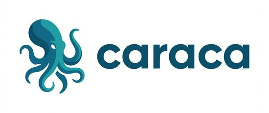
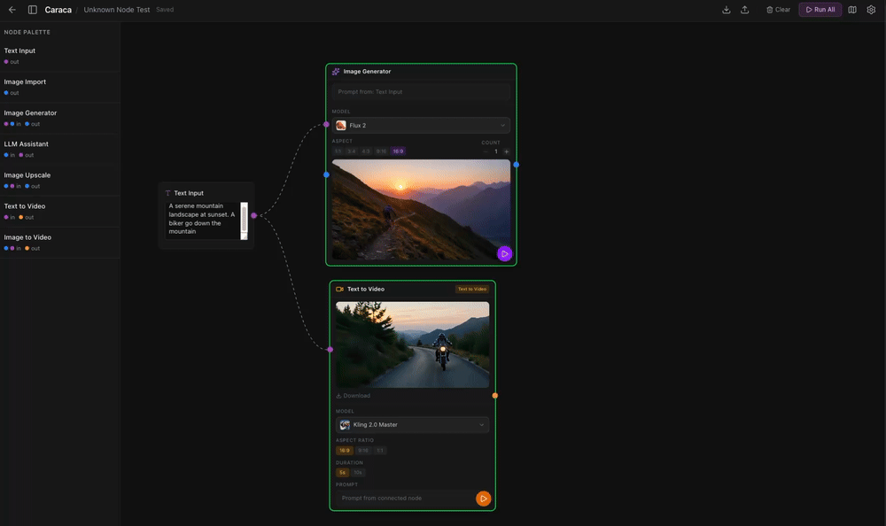

<div align="center">
  
</div>


A visual node-based editor for composing and executing AI image generation workflows.

[](LICENSE)
[](https://github.com/CPloscaru/caraca/actions/workflows/ci.yml)
[](https://nodejs.org/)
[](https://www.typescriptlang.org/)




> *Inspired by [Freepik](https://www.freepik.com/) and [ComfyUI](https://github.com/comfyanonymous/ComfyUI) — without the subscription lock-in of Freepik and without the complexity of ComfyUI.*

## Table of Contents

- [Quick Start](#quick-start)
- [Usage](#usage)
- [Architecture](#architecture)
- [Roadmap](#roadmap)
- [Contributing](#contributing)
- [License](#license)
- [Links](#links)

## Quick Start

### Prerequisites

- [Node.js](https://nodejs.org/) >= 18
- npm

### Setup

**1. Clone the repository**

```bash
git clone https://github.com/CPloscaru/caraca.git && cd caraca
```

**2. Install dependencies**

```bash
npm install
```

**3. Configure environment**

```bash
cp .env.example .env
```

Open `.env` and fill in the required keys:

- `FAL_KEY` (required) -- API key for image/video generation. Get one at [fal.ai](https://fal.ai/dashboard/keys).
- `OPENROUTER_KEY` (optional) -- Enables the LLM Assistant node. Get one at [OpenRouter](https://openrouter.ai/keys).

See `.env.example` for the full list of configuration options.

**4. Run the development server**

```bash
npm run dev
```

Open [http://localhost:3000](http://localhost:3000) in your browser.

## Usage

1. **Create a project** from the dashboard.
2. **Add nodes** from the sidebar or command palette (press `/`).
3. **Connect nodes** by dragging between ports. Ports are color-coded by type: blue for images, purple for text.
4. **Configure parameters** on each node -- select a model, write prompts, adjust settings.
5. **Run** individual nodes or the entire workflow.
6. **Export/import** workflows as `.caraca.json` files to share or back up your work.

## Architecture

### Tech Stack

| Layer | Technology |
|-------|------------|
| Framework | Next.js 16 (App Router + API Routes) |
| UI | React 19, Tailwind CSS 4, Shadcn UI |
| Canvas | xyflow (React Flow) |
| State | Zustand |
| Database | Drizzle ORM + SQLite (better-sqlite3) |
| AI - Images | fal.ai SDK |
| AI - LLM | OpenRouter API |

### System Diagram

```
+--------------------------------------------------+
|                  Next.js 16                       |
|            (App Router + API Routes)              |
+-------------+----------------+-------------------+
|  React 19   |    Zustand     |      xyflow       |
|  (UI)       |    (State)     |      (Canvas)     |
+-------------+----------------+-------------------+
|             Drizzle ORM + SQLite                  |
+--------------------------------------------------+
|       fal.ai SDK       |    OpenRouter API       |
|   (Image/Video Gen)    |    (LLM Assistant)      |
+--------------------------------------------------+
```

### Project Structure

```
src/
  app/          Pages and API routes (Next.js App Router)
  components/   React components
  hooks/        Custom React hooks
  lib/          Core logic, DAG engine, utilities
  stores/       Zustand state stores
  types/        TypeScript type definitions
```

## Roadmap

**Current status:** v0.1.1

What is available today:

- Node-based workflow editor with drag-and-drop canvas
- Image and video generation via fal.ai
- LLM assistant via OpenRouter with multi-image vision support
- Text display node for LLM output inspection
- Dynamic schema-driven ports (image and text)
- Markdown notes and annotations on canvas
- Model favorites and info popovers
- Debug view with JSON tree and image preview
- Per-project file storage with image download
- Budget tracking badges (fal.ai & OpenRouter balances)
- Project persistence with SQLite
- Workflow templates
- Export/import as `.caraca.json`
- Landing page at [caraca.to](https://caraca.to)

Community contributions are welcome. Check the [issue tracker](https://github.com/CPloscaru/caraca/issues) for feature requests and known issues.

## Contributing

Contributions are welcome! Whether it is a bug report, feature request, or pull request, your input helps improve Caraca.

- Read [CONTRIBUTING.md](CONTRIBUTING.md) for setup instructions, branching conventions, and coding guidelines.
- Follow the [Code of Conduct](CODE_OF_CONDUCT.md).
- Report security vulnerabilities privately via [SECURITY.md](SECURITY.md).

## License

[MIT](LICENSE)

## Links

- [GitHub Repository](https://github.com/CPloscaru/caraca)
- [Issue Tracker](https://github.com/CPloscaru/caraca/issues)
- [fal.ai Documentation](https://fal.ai/docs)
- [OpenRouter Documentation](https://openrouter.ai/docs)
